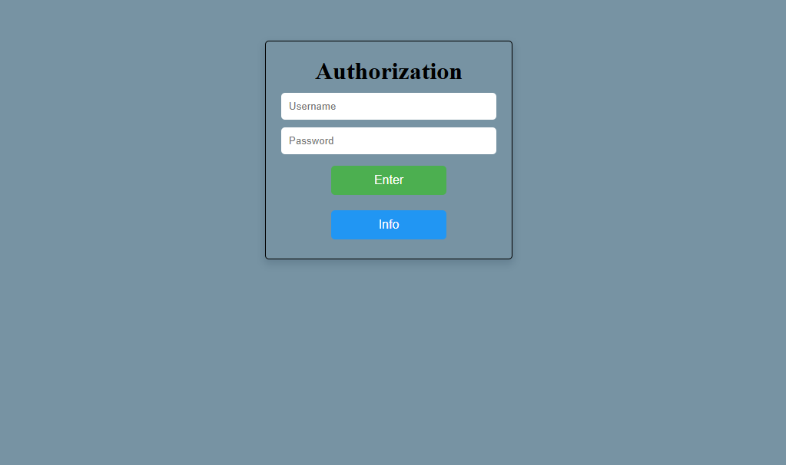
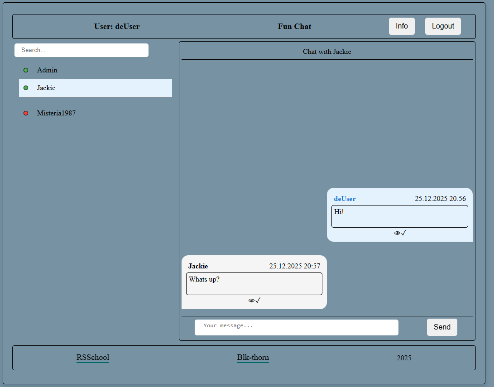

# 💬 Fun Chat

---

## 📌 Overview

**Fun Chat** is a real-time chat application built with **pure TypeScript** and **WebSocket** technology.  
It is a **Single Page Application (SPA)** that enables instant communication while giving users control over their conversation data.

---

## ✨ Features

- ⚡ Real-time messaging using WebSocket connections
- 🔑 User authentication with client-side validation
- 🟢 Online/offline user status indicators
- 🕘 Full message history with chronological order
- 🔔 Unread message counters per conversation
- 🔍 User search by name
- 📐 Responsive design (380px – 1440px)

---

## 🛠 Technology Stack

- TypeScript
- WebSocket API
- Webpack
- ESLint (Unicorn style guide)
- Prettier
- Husky

---

## 🧱 Application Structure

### Authentication Page

- Login form with validation and error handling
- Keyboard support (Enter key)
- Automatic redirect after successful login

### Main Chat Interface

- Header with username and Logout button
- User list:
    - all registered users except current user
    - online/offline status
    - unread message counters
- User search functionality
- Active chat area with message history
- Footer with school logo, author info, GitHub link, creation year

---

## ✉️ Message System

- Message includes:
    - timestamp
    - sender name
    - message text
- Status indicators:
    - Delivered
    - Read (visible only to sender)
- Empty messages are not allowed

---

## ⚙️ Key Technical Implementation

- WebSocket protocol for bidirectional communication
- Modular architecture (API / UI / state separation)
- Full TypeScript typing without `any`
- Dynamic DOM generation via JavaScript

---

## ▶️ Running the Project

### 📥 1. Clone Repositories

- `git clone https://github.com/your-username/fun-chat.git`
- `git clone https://github.com/rolling-scopes-school/fun-chat-server.git`

### 📦 2. Install Dependencies

Run in both repositories:

- `npm install`

### ⚙️ 3. Server Environment Configuration

In the fun-chat-server repository:

- Create a .env file
- You can use .env.example as a reference
- Configure the following parameters: `SERVER_PORT=4000 LOG=all`

### 🖥 4. Run the Server

- `npm run start`
  The server starts on port 4000 and listens for WebSocket connections.

### 🌐 5. Run the Client Application

- `npm run start`

---

## 📸 Preview

### Login Page

### Main Chat Interface

